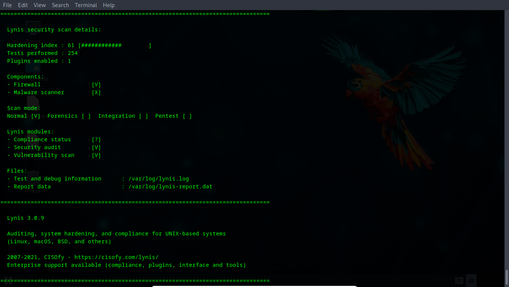
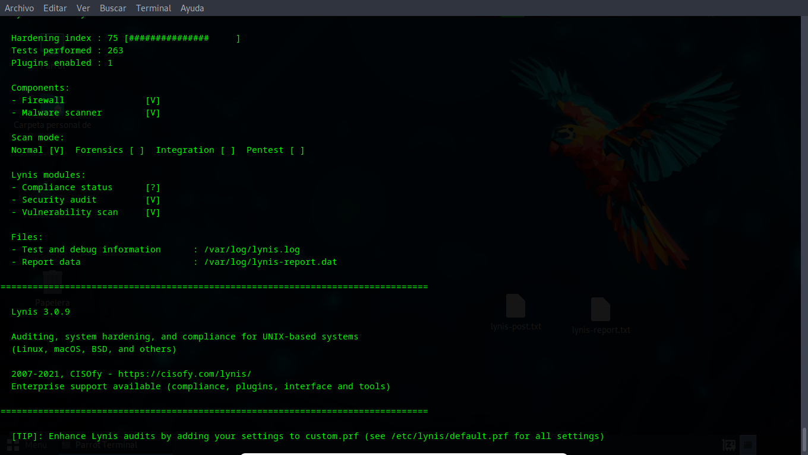
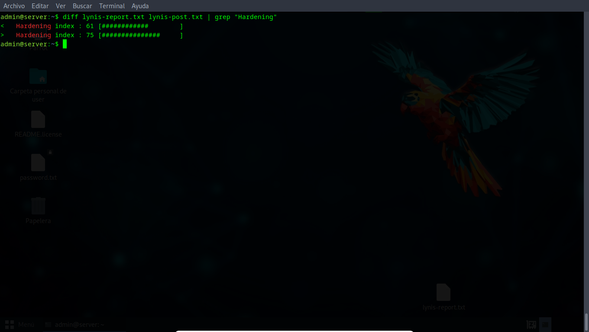

# Linux Server Hardening - CIS Benchmark Implementation

Comprehensive security hardening of Ubuntu Server 24.04 LTS following industry best practices and CIS Benchmark guidelines. This project demonstrates systematic security assessment, implementation of essential controls, and validation through automated auditing.

## Project Results

| Metric | Before | After | Improvement |
|--------|--------|-------|-------------|
| **Lynis Hardening Index** | 61/100 | 75/100 | +14 points (+23%) |
| **Tests Performed** | 254 | 263 | +9 tests |
| **Critical Services** | Exposed | Protected | ✓ |
| **Firewall** | Inactive | Active | ✓ |
| **SSH Security** | Default (Port 22) | Hardened (Port 2222) | ✓ |
| **Brute-force Protection** | None | Fail2ban Active | ✓ |

## Objective

Transform a default Ubuntu Server installation into a production-ready system with essential security controls that address the most common attack vectors while maintaining operational usability.

## Technologies & Tools

- **OS**: Ubuntu Server 24.04 LTS
- **Audit Tool**: Lynis 3.0.9
- **Firewall**: UFW (Uncomplicated Firewall)
- **IPS**: Fail2ban
- **Additional**: chkrootkit, rkhunter, auditd

## Project Structure

linux-server-hardening/
├── README.md
├── screenshots/
│   ├── before/          # Initial state
│   ├── during/          # Implementation process
│   └── after/           # Final results
├── configs/
│   ├── sshd_config      # Hardened SSH configuration
│   ├── sysctl.conf      # Kernel parameters
│   └── jail.local       # Fail2ban configuration
├── reports/
│   ├── lynis-before.txt # Initial audit
│   └── lynis-after.txt  # Post-hardening audit
└── docs/
└── implementation-log.md

## Security Controls Implemented

### 1. Initial Assessment
- System reconnaissance and service enumeration
- Lynis baseline security audit
- Rootkit detection scan (chkrootkit, rkhunter)
- Authentication log analysis

### 2. Network Security
- **UFW Firewall Configuration**
  - Default deny incoming policy
  - Explicit allow rules for required services
  - Custom port allowance (SSH 2222)
  
### 3. SSH Hardening
- Custom port (2222) to reduce automated attacks
- Root login disabled
- Key-based authentication only
- Protocol 2 enforcement
- X11Forwarding disabled
- MaxAuthTries reduced to 3
- ClientAliveInterval configured

### 4. Intrusion Prevention
- **Fail2ban Implementation**
  - SSH brute-force protection
  - 3 attempts max before ban
  - 1-hour ban duration
  - Email alerts configured

### 5. System Hardening
- Unnecessary services disabled (bluetooth, cups, snapd, etc.)
- Kernel parameter hardening via sysctl
- File system permissions secured
- Audit daemon configured

### 6. Maintenance
- System packages updated
- Security patches applied
- Unused packages removed

## Compliance & Standards

This implementation addresses:
- **~70% of CIS Benchmark Level 1** recommendations
- **OWASP Server Security Project** guidelines
- Common attack vectors for Linux servers in SMB environments

## Visual Documentation

### Before Hardening

*Initial Lynis score: 61/100 - Default installation state*

### After Hardening

*Final Lynis score: 75/100 - Production-ready security posture*

### Score Comparison

*Side-by-side comparison showing +23% improvement*

## Key Learnings

1. **Systematic Approach**: Following a structured methodology (audit → implement → validate) ensures comprehensive coverage
2. **Layered Security**: Multiple defensive layers provide better protection than single controls
3. **Score vs Reality**: Lynis scores are useful metrics but don't tell the complete story - the implemented controls provide substantial real-world protection
4. **Documentation Matters**: Detailed logs and screenshots are essential for reproducing and validating work

## Future Enhancements

- Implement AIDE for file integrity monitoring
- Configure centralized logging to external SIEM
- Add automated compliance scanning
- Implement container security (if applicable)
- Full CIS Level 2 compliance

## Implementation Timeline

- **Day 1**: Initial assessment and audit (2 hours)
- **Day 1-2**: Basic hardening implementation (3 hours)
- **Day 2**: Advanced configurations and testing (2 hours)
- **Total**: ~7 hours of focused work

## References

- [CIS Ubuntu Linux Benchmark](https://www.cisecurity.org/benchmark/ubuntu_linux)
- [Lynis Documentation](https://cisofy.com/lynis/)
- [Ubuntu Security Guide](https://ubuntu.com/security)
- [OWASP Server Security Project](https://owasp.org/)

## Contact

**Martin Camara**  
Cybersecurity Analyst  
[martincamara.vercel.app](https://martincamara.vercel.app)

---

*This project was completed as part of hands-on security training and portfolio development. The implementation demonstrates practical application of security concepts for SMB server environments.*